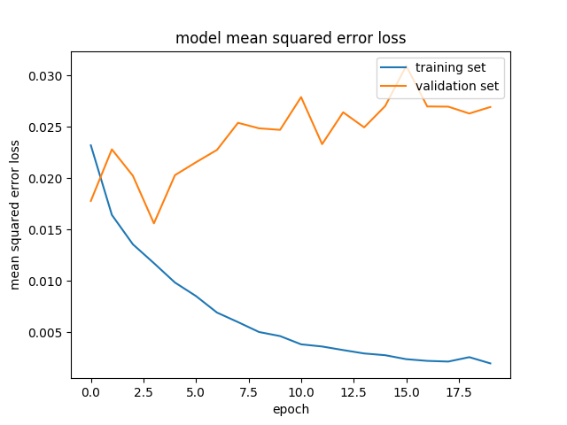

# **Behavioral Cloning** 

## Writeup Template

### You can use this file as a template for your writeup if you want to submit it as a markdown file, but feel free to use some other method and submit a pdf if you prefer.

---

**Behavioral Cloning Project**

The goals / steps of this project are the following:
* Use the simulator to collect data of good driving behavior
* Build, a convolution neural network in Keras that predicts steering angles from images
* Train and validate the model with a training and validation set
* Test that the model successfully drives around track one without leaving the road
* Summarize the results with a written report

## Rubric Points
### Here I will consider the [rubric points](https://review.udacity.com/#!/rubrics/432/view) individually and describe how I addressed each point in my implementation.  

---
### Files Submitted & Code Quality

#### 1. Submission includes all required files and can be used to run the simulator in autonomous mode

My project includes the following files:
* model.py containing the script to create and train the model
* drive.py for driving the car in autonomous mode
* model.h5 containing a trained convolution neural network 
* writeup_report.md summarizing the results

#### 2. Submission includes functional code
Using the Udacity provided simulator and my drive.py file, the car can be driven autonomously around the track by executing 
```sh
python drive.py model.h5
```

#### 3. Submission code is usable and readable

The model.py file contains the code for training and saving the convolution neural network. The file shows the pipeline I used for training and validating the model, and it contains comments to explain how the code works.

### Model Architecture and Training Strategy

#### 1. An appropriate model architecture has been employed

Our model consists of a convolution neural network with 5 `Conv2D` layers, all of them using `relu` as their activation function. The first three had `5x5` filter sizes and the following two had `3x3` filter sizes. They all had `24, 36, 48, 64 and 64` filters respectively. 

Following that, we had a `Dropout` layer with `rate=0.8` followed by a flatten layer and 4 fully connected (`Dense`) layers, with `100, 50, 10 and 1` units respectively.

The model is defined in the function `udacity_model()` (lines 88 to 105) and is then compiled the Adam optimizer and Mean Squared Error (`mse`) as it's loss function. This function was chosen since we want it to reduce the difference between the predicted steering angle and the one on the training set.

This model is largely based on the one used on [this post](https://developer.nvidia.com/blog/deep-learning-self-driving-cars/) presented by Nvidia, with an additional dropout layer.

#### 2. Attempts to reduce overfitting in the model

The model contains one dropout layer in order to reduce overfitting, with a dropout rate of `0.8` (line 97).

The model was tested by running it through the simulator and ensuring that the vehicle could stay on the track.

#### 3. Model parameter tuning

The model used an adam optimizer, so the learning rate was not tuned manually (model.py line 126). We also considered `3 epochs` to result in an appropiate validation loss.

#### 4. Appropriate training data

Training data was chosen to keep the vehicle driving on the road. We used a combination of center lane driving and smooth driving around curves (as much as our driving ability allowed for).

That driving data was then augmented by using the car's side cameras. Since the car in the simulator has three mounted front-facing cameras, we could employ the left and right ones to train the model to recover from driving on the side of the lane. This was used by assigning a modified steering angle to each side image (`+0.2` for the left image and `-0.2` for the right one). Since these pictures were taken from the sides of the road, the model will interpret them as the car steering back to the lane center when it went too far off tot he side.

We also augmented it by duplicating and flipping all and inverting their steering angles. This helped the model generalize, preventing it from taking mostly left turns, the most prevalent ones in the training track. This was also helped by recording an extra lap driving clockwise.

Finally, we cropped the images leaving only the road portion. This makes it so most distracting features (like trees) are removed from them and don't distract the model, making it focus mostly on the road.

### Model Architecture and Training Strategy

#### 1. Solution Design Approach

The overall strategy for deriving a model architecture was to take a preexisting one that worked well for a similar problem and improve on it for our particular case.

Our first step was to use a convolution neural network model similar to the one used by Nvidia as shown in section 1 of this writeup.

In order to gauge how well the model was working, I split my image and steering angle data into a training and validation set. I found that my first model had a low mean squared error on the training set but a high mean squared error on the validation set. This implied that the model was overfitting. 

To combat the overfitting, we modified the model so that it randomly dropped some neuron connections before the fully connected layers near the end. This is a typical approach to reduce overfitting, and is usually done with a dropout layer.

The final step was to run the simulator to see how well the car was driving around track one. After all the work done on the model, it drove without without ever leaving the track and maintaining a fairly stable course near the center of the lane.

#### 2. Final Model Architecture

The final model architecture (model.py lines 88-105) consisted of a convolution neural network with the following layers and layer sizes:
- Cropping layer
- Normalization layer
- Convolutional layer (`filters=24, kernel_size=5x5, subsample=2x2, activation=relu`)
- Convolutional layer (`filters=36, kernel_size=5x5, subsample=2x2, activation=relu`)
- Convolutional layer (`filters=48, kernel_size=5x5, subsample=2x2, activation=relu`)
- Convolutional layer (`filters=64, kernel_size=3x3, activation=relu`)
- Convolutional layer (`filters=64, kernel_size=3x3, activation=relu`)
- Convolutional layer (`filters=64, kernel_size=3x3, activation=relu`)
- Dropout layer (`rate=0.8`)
- Flatten layer
- Fully Connected layer (`units=100, activation=relu`)
- Fully Connected layer (`units=50, activation=relu`)
- Fully Connected layer (`units=10, activation=relu`)
- Fully Connected layer (`units=1, activation=relu`)

#### 3. Creation of the Training Set & Training Process

To capture good driving behavior, we first recorded three laps on track one using center lane driving.

We then recorded one extra lap going on the opposite direction, which will help the model generalize better.

There was no need to record an extra lap recovering from driving on the sides of the lane, since that was already achieved by employing the car's left and right cameras as mentioned before.

After recording the data we had 16932 data points. This was multiplied by 6 with the augmentation mentioned before.

We finally randomly shuffled the data set and put 20% of the data into a validation set (20318 images). 

I used this training data for training the model. The validation set helped determine if the model was over or under fitting. The ideal number of epochs was 3 as evidenced by these images, in which we can see there is a minimum in validation loss at epoch 3 and it increases over time because of overfitting.



I used an adam optimizer so that manually training the learning rate wasn't necessary.

#### 4. Future improvements:
- Make the car drive properly on the second track
- Augment dataset by changing brightness and adding random shadows
- Try other activation functions like LeakyRelu
- Use generators to feed data during training to avoid memory problems
